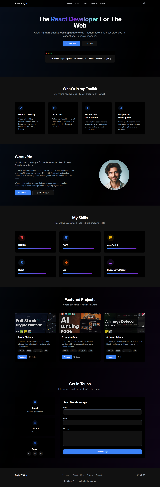
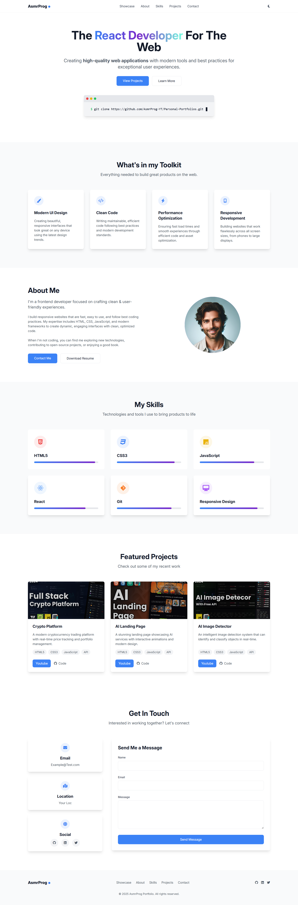

# Tailwind Portfolio #01
Want to build a Professional Developer Portfolio using just HTML, CSS, JS, and Tailwind CSS? In this tutorial, we’ll create a fully responsive personal portfolio website with a sleek UI, Light/Dark mode toggle, and modern design features! 🌗💼

🔥 What You’ll Learn:

* Creating a Developer Portfolio with only HTML, CSS, JS, and TailwindCSS – No frameworks needed! ⚡ 
* Light & Dark Mode Toggle – Smooth theme switcher using JavaScript and Tailwind. 🌙☀️ 
* Building Clean & Responsive UI – Optimized layout for all devices using utility-first CSS. 📱💻 
* Interactive Sections – About, Skills, Projects, and Contact Form with functional design. ✉️ 
* Modern Styling Techniques – Minimalist design, gradient text, icons, and polished UI components. 🎨 

## Prerequisites
Make sure you have **Node.js** and **npm** installed on your machine. If not, you can download them from [here](https://nodejs.org/).

<a href="https://youtu.be/IMpYS8kDI4g" target="_blank">Watch Tutorial</a>

## Instructions
1. Open **Command Prompt** or **VS Code Terminal** in your project folder.
2. **Install dependencies** by running the following command:
```bash
npm i
```
3. Start the development server by running:
```bash
npm run dev
```

This will start the server, and you can access your project in the browser at http://localhost:3000 (or the configured port).

# Screenshot

Here we have project screenshot :

#### Dark Mode

#### Light Mode

